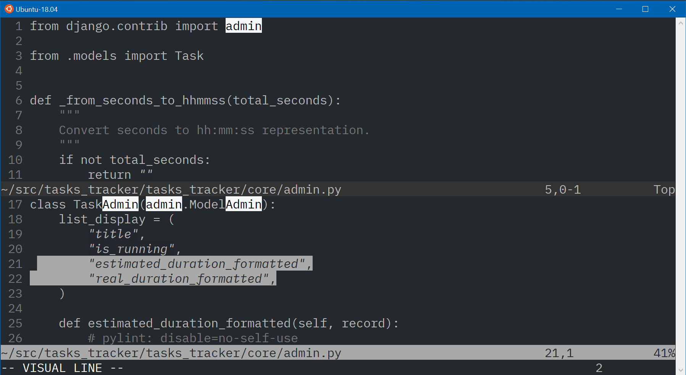
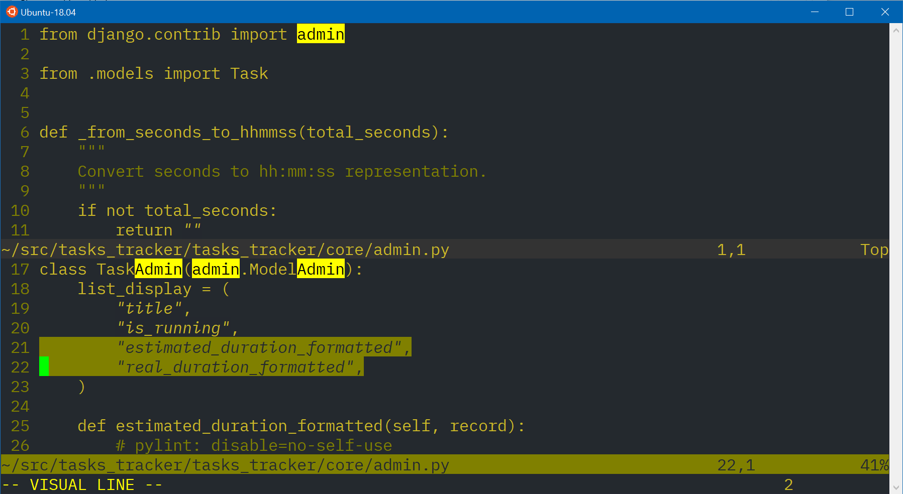
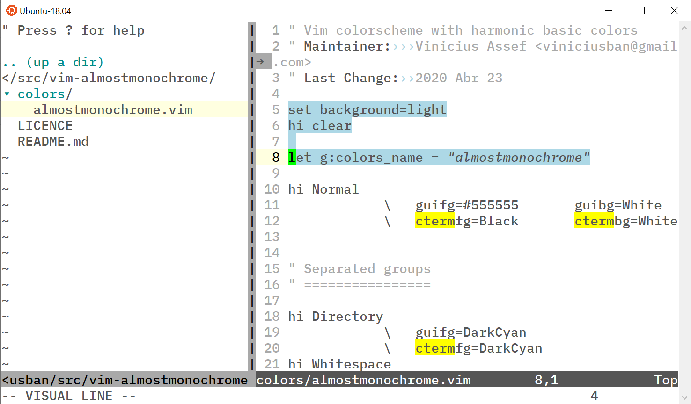
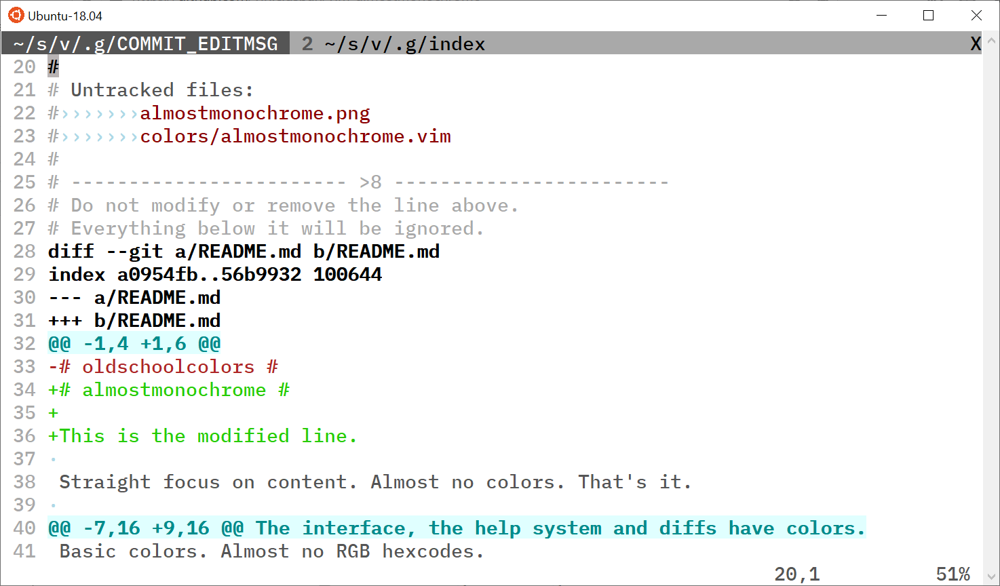
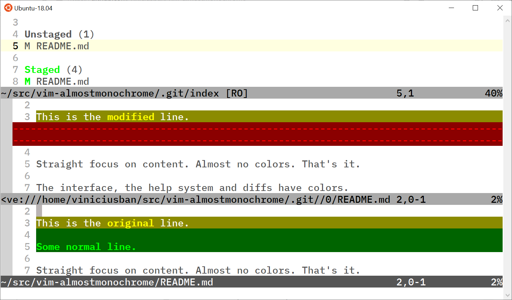

# White on Black #

Basic colors. Few colors.
Best if your terminal supports _italic_.

White letters over black background (whiteonblack):

Yellow letters over black background (yellowonblack):

Black letters over white background (blackonwhite):

## Installation ##

Using Vundle:

    Plugin 'viniciusban/vim-distractionfree-colorschemes'
    set termguicolors  | " not required, but way better
    colorscheme whiteonblack | " or yellowonblack, or blackonwhite

## License

MIT.
