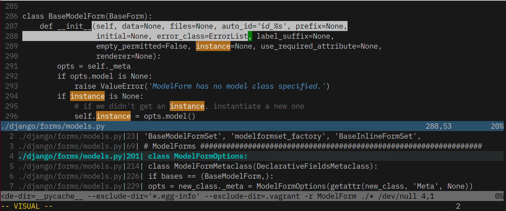

# White letters over Black background #

Comfortable and just a few colors. Good to focus and concentrate.

Best if your terminal supports _italic_ and **bold**.

## Installation ##

Using Vundle:

    Plugin 'viniciusban/vim-white-on-black-colorscheme'
    set termguicolors
    colorscheme white_on_black

## License

MIT.
